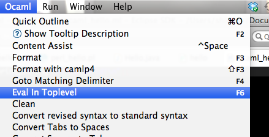

Hello World in OCaml with Eclipse
=================================

.. |s2| image:: Screen-Shot-2012-10-29-at-5.15.16-PM.png
   :width: 450px

.. highlight:: ocaml

Assume Eclipse has been installed,

1. Download and install OCaml (http://caml.inria.fr/download.en.html)

2. Open Eclipse, Help -> Install New Software, enter "http://www.algo-prog.info/ocaide/" as repository site, and install this plugin. Restart Eclipse after finish.

3. Turn the current perspective into OCaml by Window -> Open Perspective.

4. Then, create a new project named "ocaml_hello" by New -> OCaml Project. And create a new Module named "ocaml_hello" or simply a file with .ml extension.

5. Write the code::

       print_string "Hello world!\n";;

6. Press F6 (Fn+F6 on Mac) or OCaml -> Eval In Toplevel, and the console “OCaml Toplevel” at the bottom will output results.

   |s1|

   |s2|

.. author:: default
.. categories:: none
.. tags:: OCaml,Eclipse
.. comments::
