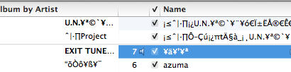
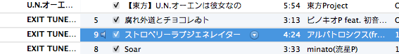

Open an application with a specific language on Mac OS X
========================================================

.. |s2| image:: Screen-Shot-2012-11-21-at-2.14.31-PM.png
   :width: 450px
.. |s3| image:: Screen-Shot-2012-11-21-at-2.30.03-PM.png
   :width: 450px

While using iTunes on Mac OS X I encounter some little different issues from those on Windows. For example, some quasi-ID3-edited MP3 files suffer Mojibake in Japanese texts. Simple built-in conversion does not render them well. Even changing the language/region setting to “Japanese” fails to fix that. However, when changing language setting to "Chinese", everything seems back to normal.

|s1|

As far as I can tell after exploration, the cause was probably importing songs containing Japanese characters on Windows (Chinese) and then transfering to Mac, because those retrieved on Mac seem alright. But this does not apply to all that has the problem; some other songs transferred from Windows remain intact.

|s2|

It sounds a horrible idea to re-edit all ID3 in a proper language environment, so setting iTunes to a default language may be a compromising solution. Hands-on workaround in a simple like `this <http://hints.macworld.com/article.php?story=20061001065101830>`_ does not work any longer, and a new tool shows up — `Language Switcher <http://www.macupdate.com/app/mac/31850/language-switcher>`_.

|s3|

Install and open it, choose "Chinese (China)" as the default start-up language for iTunes and relaunch the program. As you can see, ID3 are displayed properly as if having the system switched into Chinese.

|s4|

**UPDATE**

As suggested by `drivel <https://twitter.com/gnudog>`_, ``mid3iconv -e GBK *.mp3`` command from the `mutagen <https://pypi.python.org/pypi/mutagen>`_ Python package can used to solve the problem once for all.

.. author:: default
.. categories:: none
.. tags:: OS X
.. comments::
