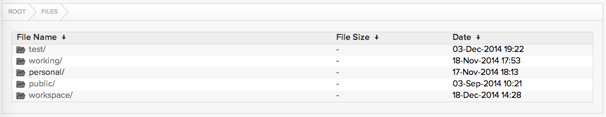

Serving local filesystem using nginx on OS X
============================================

Sometimes you may want to access certain files on one computer from other LAN clients using web browsers, for example, a directory of PDF files, or some MP4/MOV videos that can be easily streamed through `HTML5 Video <http://www.w3schools.com/html/html5_video.asp>`_.

To make things easy, we can set up an nginx server with `Nginx Fancy Index module <https://github.com/aperezdc/ngx-fancyindex>`_ to serve certain directories on one or more filesystems on your OS X system.

We can install all required software using homebrew and we need to do some hacks on the forumla. The following setup were tested on OS X 10.10.

.. highlight:: shell-session

First, tap `homebrew-nginx <https://github.com/Homebrew/homebrew-nginx>`_:

::

    $ brew tap homebrew/nginx

As of writing, the version of fancyindex-nginx-module provided by this formula is 0.3.2, but we need 0.3.3 which `allows sorting elements by name (default), modification time <http://wiki.nginx.org/NgxFancyIndex>`_. So we need to edit the formula file:

::

    $ vim /usr/local/Library/Taps/homebrew/homebrew-nginx/Formula/fancyindex-nginx-module.rb

and change ``https://github.com/aperezdc/ngx-fancyindex/archive/v0.3.2.tar.gz`` into ``https://github.com/aperezdc/ngx-fancyindex/archive/v0.3.3.tar.gz``.

Then, install nginx by building with the Fancy Index Module:

::

    $ brew install nginx-full --with-fancyindex-module

If brew complains about SHA1 error, then you have to modify the ``sha1`` value of the previous fomula to match the actual sha1 in the error output.

Download `FancyIndex Theme <https://github.com/TheInsomniac/Nginx-Fancyindex-Theme>`_ to ``/usr/local/etc/nginx/fancyindex``:

::

    $ git clone https://github.com/TheInsomniac/Nginx-Fancyindex-Theme.git /usr/local/etc/nginx/fancyindex

All that remains to be done is configuration. Assume you want to serve ``/path/to/movies`` and ``/another/path/to/pdf`` directories, you can use alias ``movies`` and ``pdf`` to point to these locations. Edit ``/usr/local/etc/nginx/nginx.conf`` and modify the ``server`` block under ``http`` block:

.. highlight:: nginx

::

    server {
        listen       8080;
        server_name  localhost;

        fancyindex on;
        fancyindex_exact_size off;
        fancyindex_localtime on;
        fancyindex_header "/fancyindex/header.html";
        fancyindex_footer "/fancyindex/footer.html";
        fancyindex_ignore "fancyindex";

        location /movies {
            alias /path/to/movies/;
        }

        location /pdf {
            alias /another/path/to/pdf/;
        }
        
        location /fancyindex/ {
            alias /usr/local/etc/nginx/fancyindex/;
        }
    }

The config above is just a minimum configuration. You may add extra configurations (e.g. ``error_log``, ``error_page``) according to your need. Note the paths for the ``alias`` directives, there must be trailing slashes, such as ``alias /path/to/movies/``.

.. highlight:: shell-session

Start nginx:

::

    $ nginx

If you make any changes to the ``nginx.conf``, remember to reload:

::

    $ nginx -s reload

You can check whether the port 8080 is in the LISTEN state:

::

    $ sudo netstat -anf inet -p tcp | grep LISTEN

Finally, if you want to keep your firewall on and nginx trusted, run the following command:

::

    $ brew install coreutils
    $ sudo /usr/libexec/ApplicationFirewall/socketfilterfw --add $(greadlink -f /usr/local/bin/nginx)

You can test from local http://127.0.0.1:8080/movies as well as http://youripaddress:8080/movies and http://youripaddress:8080/pdf from a browser on your LAN clients.

|s1|

.. author:: default
.. categories:: none
.. tags:: Nginx,OS X
.. comments::
