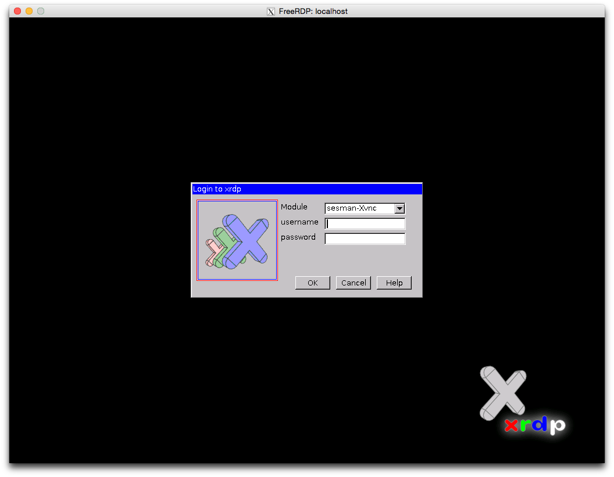

Tunneling RDP over SSH with xrdp and xfreerdp
=============================================

.. highlight:: shell-session

Suppose you have a remote desktop but you only have SSH access and you need to connect to that desktop with GUI. For example, you have a server at home and you've setup port forwarding on your router so that you can SSH to your that home server from office or school, and you don't want to expose too many ports to the Internet. You can setup xrdp server and tunnel your connection over SSH.

In the following texts, the home server is Fedora 20 and the client laptop is OS X Yosemite.

Install xrdp on home server
---------------------------

On your home server, run:

::

    # yum install xrdp
    # systemctl start xrdp.service
    # systemctl enable xrdp.service

Configure firewall
------------------

Add SSH service and open port 3389 to the current zone and make it permanent. By opening port 3389, you can connect directly to the home server without SSH when your laptop is in the same network at home.

::

    # firewall-cmd --add-service=ssh --permanent
    # firewall-cmd --add-port=3389/tcp --permanent
    # firewall-cmd --reload

Install xfreerdp using homebrew
-------------------------------

Make sure you've installed XQuartz. You can download the dmg at http://xquartz.macosforge.org/landing/ .

On your OS X laptop:

::

    $ brew update
    $ brew install freerdp

Start SSH forwarding
--------------------

After you make sure you can SSH to your home server (say 1.1.1.1), you can start SSH forwarding. Run the following command in one terminal session:

::

    $ ssh -qnN -L 3389:127.0.0.1:3389 1.1.1.1

Connect to home server using xfreerdp
-------------------------------------

::

    $ xfreerdp localhost

Then, you should have a X11 window show up as in the screenshot below. Enter your username and password to login to your home server.

|s1|

.. author:: default
.. categories:: none
.. tags:: Fedora,RDP,OS X,Linux,SSH,Tunneling
.. comments::
