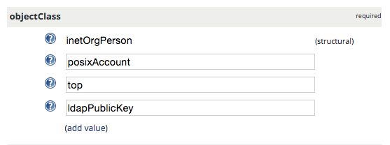
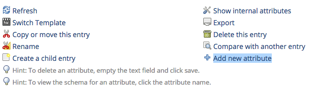

Setup OpenLDAP server with OpenSSH-LPK on Ubuntu 14.04
======================================================

This post documents how to setup a secure OpenLDAP server that is able to make OpenLDAP client servers accept authorized SSH access requests from users. 
The following steps assume the OpenLDAP server (slapd) and phpLDAPadmin are installed as referenced in the `initial setup <https://www.digitalocean.com/community/tutorials/how-to-install-and-configure-a-basic-ldap-server-on-an-ubuntu-12-04-vps>`__.

Instructions and references
---------------------------

-  `Initial setup <https://www.digitalocean.com/community/tutorials/how-to-install-and-configure-a-basic-ldap-server-on-an-ubuntu-12-04-vps>`__
-  `OpenSSH-LPK <https://code.google.com/p/openssh-lpk/>`__ and `ssh-ldap-pubkey <https://github.com/jirutka/ssh-ldap-pubkey>`__ (on LDAP clients)
-  `Force authentication <http://lucor.github.io/post/ubuntu-and-ldap-force-authentication-during-a-bind-request/>`__
-  `Secure LDAP with SSL/TLS <http://rogermoffatt.com/2011/08/24/ubuntu-openldap-with-ssltls/>`__

Understanding cn=config (LDAP database)
---------------------------------------

The default installation of OpenLDAP in recent versions of Ubuntu uses the new `runtime configuration (RTC)
system <https://help.ubuntu.com/community/OpenLDAPServer#Installation>`__ or olc (OpenLDAP Configuration). This installation uses ``cn=config`` (the LDAP database) for configuration rather than the old style ``slapd.conf``.

Schemas
-------

The schemas can be imported dynamically into ``cn=config`` database, without restarting ``slapd``. The schemas to be imported can placed in
``/etc/ldap/schema``.

The following schema in ldif format will be used and discussed in the subsequent sections:

-  ``openssh-lpk.ldif``
-  ``ldap_disable_bind_anon.ldif``
-  ``ssl.ldif``

Importing openssh-lpk scheme
----------------------------

::

    ldapadd -Y EXTERNAL -H ldapi:/// -f openssh-lpk.ldif 

where ``openssh-lpk.ldif`` is:

::

    dn: cn=openssh-lpk,cn=schema,cn=config
    objectClass: olcSchemaConfig
    cn: openssh-lpk
    olcAttributeTypes: ( 1.3.6.1.4.1.24552.500.1.1.1.13 NAME 'sshPublicKey' 
      DESC 'MANDATORY: OpenSSH Public key' 
      EQUALITY octetStringMatch
      SYNTAX 1.3.6.1.4.1.1466.115.121.1.40 )
    olcObjectClasses: ( 1.3.6.1.4.1.24552.500.1.1.2.0 NAME 'ldapPublicKey' SUP top AUXILIARY
      DESC 'MANDATORY: OpenSSH LPK objectclass'
      MAY ( sshPublicKey $ uid ) 
      )

Forcing authentication
----------------------

By default, OpenLDAP allows anonymous query from any client servers. You may want to enable authentication so that only authenticated clients are able to query the server:

::

    ldapadd -Y EXTERNAL -H ldapi:/// -f ldap_disable_bind_anon.ldif

where ``ldap_disable_bind_anon.ldif`` is:

::

    dn: cn=config
    changetype: modify
    add: olcDisallows
    olcDisallows: bind_anon

    dn: cn=config
    changetype: modify
    add: olcRequires
    olcRequires: authc

    dn: olcDatabase={-1}frontend,cn=config
    changetype: modify
    add: olcRequires
    olcRequires: authc

.. more::

Securing LDAP with TLS
----------------------

-  Install the package that provides ``certtool``:

   ::

       apt-get install gnutls-bin

-  Generate new certificate (self-signed) and key:

   ::

       mkdir -p /etc/ldap/gnutls
       cd  /etc/ldap/gnutls
       certtool --generate-self-signed --load-privkey ldap.gnutls.key --outfile ldap.gnutls.crt

-  Fix permission of private key:

   ::

       chmod +r /etc/ldap/gnutls/ldap.gnutls.key

Importing SSL schema
--------------------

::

    ldapmodify -Y EXTERNAL -H ldapi:/// -f ssl.ldif

where ssl.ldif is:

::

    dn: cn=config
    changetype: Modify
    add: olcTLSCertificateKeyFile
    olcTLSCertificateKeyFile: /etc/ldap/gnutls/ldap.gnutls.key
    -
    add: olcTLSCertificateFile
    olcTLSCertificateFile: /etc/ldap/gnutls/ldap.gnutls.crt
    -
    add: olcTLSCipherSuite
    olcTLSCipherSuite: NORMAL
    -
    add: olcTLSCRLCheck
    olcTLSCRLCheck: none
    -
    add: olcTLSVerifyClient
    olcTLSVerifyClient: never

Enabling LDAPS
--------------

By default, only ``ldap`` and ``ldapi`` (Unix domain socket) are enabled. Make ``ldap`` listen to only 127.0.0.1 and keep the latter so that you can run ldap utilty commands against ``ldapi:///`` without providing credentials if working on the same server.

Edit ``/etc/default/slapd`` and ensure the following line:

::

    SLAPD_SERVICES="ldap://127.0.0.1:389/ ldaps:/// ldapi:///"

Configuring /etc/ldap/ldap.conf
-------------------------------

Edit ``/etc/ldap/ldap.conf`` and add the following line:

::

    TLS_REQCERT never

Testing the above LDAPS config
------------------------------

::

    ldapsearch -d 9 -D "cn=Bob,ou=users,dc=example,dc=com" \
     -w password -b "dc=example,dc=com" -H "ldaps://ldap.example.org" "objectClass=*"

Customizing phpLDAPadmin config and templates
-------------------------------------------
You can customize template configurations (``/etc/phpldapadmin/config.php``).

For example, change the base uid and gid to a greater value:

::

    $servers->setValue('auto_number','min',array('uidNumber'=>3000,'gidNumber'=>3000));

Add

::

    $config->custom->appearance['theme'] = 'tango';

You can also customize templates for various components, for example, POSIX account:

-  /etc/phpldapadmin/templates/creation/posixAccount.xml

Customize themes and styles:

-  /usr/share/phpldapadmin/lib/page.php
-  /usr/share/phpldapadmin/htdocs/css/tango/style.css
 
Adding a user with SSH public key in phpLDAPadmin
-------------------------------------------------

First, create a user with the "Generic: User Account" template. Then, go to the "objectClass" attribute section, click "add value", and choose the "ldapPublicKey" attribute. After you submit, go back to the user edit page, click "Add new attribute" on the top part, and choose "sshPublicKey", paste the public key into the text area, and finally click "Update Object".

|s1|

|s2|

.. author:: default
.. categories:: none
.. tags:: OpenLDAP,Ubuntu,SSH
.. comments::
